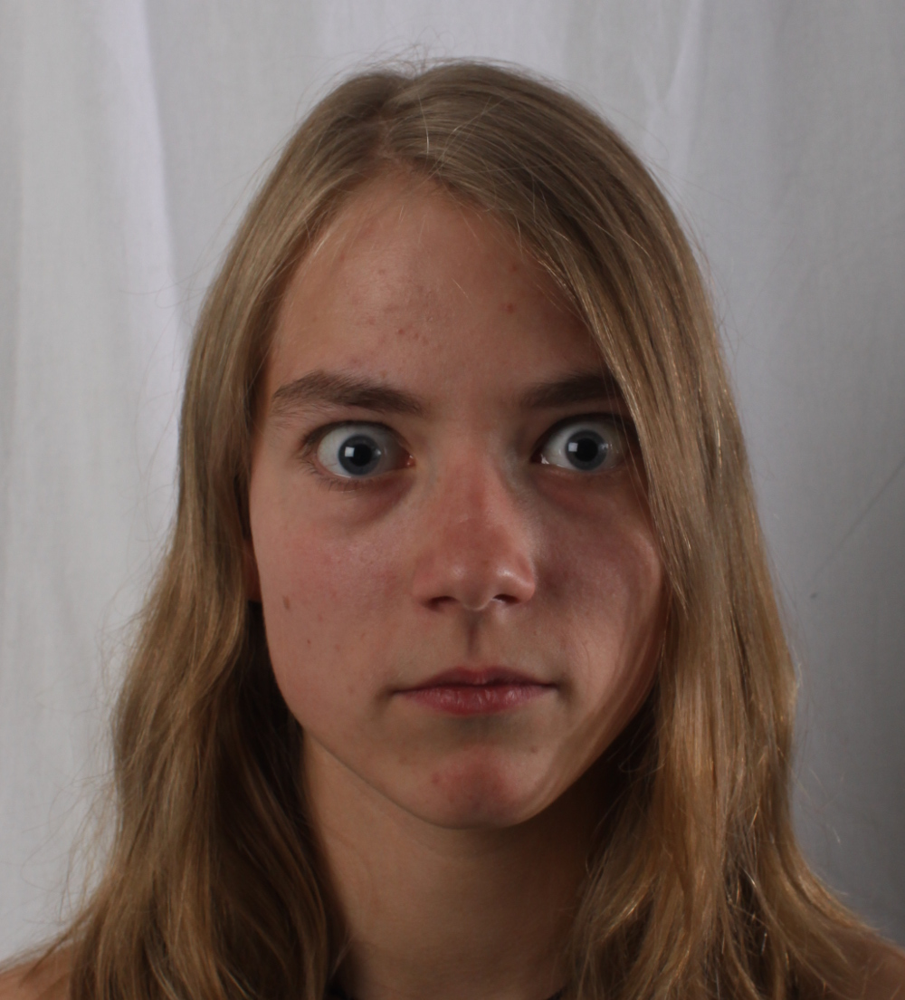

<head>
<title>Photalgography</title>
<meta http-equiv="content-type" content="text/html; charset=UTF-8">
</head>

<body style='margin:0 5% 0 5%; padding:5%; font-family:Trebuchet MS, Helvetica, sans-serif'>
  <h1>Photalgography</h1>
  Photalgography -- algorithmic photography, is a collection of algorithms to manipulate images, written in Python.
  <h2>Frequency merging</h2>
  These functions use different frequencies of two images in order to blend the images together in different ways.
  <h3> Hybrid images </h3>
  The functions in hybrid_image allow the user to merge the high frequencies (details) of one image with the low frequencies (shapes) of the other image. The result looks like one image from close up, and the other from further away. An example of usage is in main_hybrid.
<table>
  <tr>
    <th class="tg-s268">image 1</td>
    <th class="tg-s268">image 2</td>
    <th class="tg-s268">hybrid</td>
    <th class="tg-s268">image 1</td>
    <th class="tg-s268">image 2</td>
    <th class="tg-s268">hybrid</td>
  </tr>
    <tr>
    <td class="tg-s268">
      
    </td>
    <td class="tg-s268">
      
    </td>
    <td class="tg-s268">
      
    </td>
    <td class="tg-s268">
      
    </td>
    <td class="tg-s268">
      
    </td>
    <td class="tg-s268">
      
    </td>
  </tr>
  <tr>
    <td class="tg-s268"><a href=" http://images4.fanpop.com/image/photos/22100000/My-realy-hot-kitten-tiger-kittens-22123050-600-600.jpg ">source</a></td>
    <td class="tg-s268"><a href=" https://i.dailymail.co.uk/i/pix/2012/12/20/article-0-1697C38D000005DC-517_964x642.jpg ">source</a></td>
  </tr>
</table>

  <h3> Spliced images </h3>
  The functions in splice_image allow the user to splice two images together according to a predefined mask. This works by blending different frequency bands (laplacian stack) together and then combining the blended frequency bands. An example of usage can be found in main_splice.
<table>
  <tr>
    <td>original image</td>
    <td>input image 1</td>
    <td>input image 2</td>
    <td>input mask</td>
    <td>output image</td>
  <tr>
    <td class="tg-s268">
      
    </td>
    <td class="tg-s268">
      
    </td>
    <td class="tg-s268">
      
    </td>
    <td class="tg-s268">
      
    </td>
    <td class="tg-s268">
      
    </td>
  </tr>
  <tr>
    <td class="tg-s268"><a href=" http://historyofarmenia.org/wp-content/uploads/2017/06/maxresdefault.jpg ">source</a></td>
    <td></td>
    <td class="tg-s268"><a href=" https://i.ytimg.com/vi/J1lYtk16UMQ/maxresdefault.jpg ">source</a></td>
  </tr>
</table>
  
 Approach: a laplacian stack is a group of images containing different frequency bands of a single input image. In order to splice two images together, laplacian stacks must be created of the input images, as well as the mask defining the area to splice. Then, the respective frequency bands are combined (spliced) separately (<i>image1_bandX * mask_bandX + image2_bandX * (1-mask_bandX))</i>. Finally, the spliced stack is rebuilt to create the final image.
  

<table>
  <tr>
    <th class="tg-s268"></td>
    <th class="tg-s268">masked frequency band (sigma: 1)</td>
    <th class="tg-s268">masked frequency band (sigma: 2)</td>
    <th class="tg-s268">masked frequency band (sigma: 4)</td>
    <th class="tg-s268">masked frequency band (sigma: 8)</td>
    <th class="tg-s268">masked frequency band (sigma: 16)</td>
    <th class="tg-s268">masked frequency band (sigma: 32)</td>
  </tr>
  <tr>
    <td>lion</td>
    <td class="tg-s268">
      
    </td>
    <td class="tg-s268">
      
    </td>
    <td class="tg-s268">
      
    </td>
    <td class="tg-s268">
      
    </td>
    <td class="tg-s268">
      
    </td>
    <td class="tg-s268">
      
    </td>
  </tr>
  <tr>
    <td>dandelion</td>
    <td class="tg-s268">
      
    </td>
    <td class="tg-s268">
      
    </td>
    <td class="tg-s268">
      
    </td>
    <td class="tg-s268">
      
    </td>
    <td class="tg-s268">
      
    </td>
    <td class="tg-s268">
      
    </td>
  </tr>
  <tr>
    <td>sum</td>
    <td class="tg-s268">
      
    </td>
    <td class="tg-s268">
      
    </td>
    <td class="tg-s268">
      
    </td>
    <td class="tg-s268">
      
    </td>
    <td class="tg-s268">
      
    </td>
    <td class="tg-s268">
      
    </td>
  </tr>
</table>

<h2>Image transformation merging</h2>

</body>
