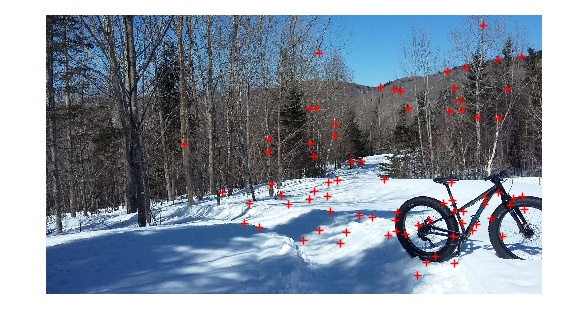

<head>
<meta http-equiv="content-type" content="text/html; charset=UTF-8">
</head>
<body style='margin:0 5% 0 5%; padding:5%; font-family:Trebuchet MS, Helvetica, sans-serif'>
  <h1>Photalgography</h1>
  Photalgography -- algorithmic photography, is a collection of algorithms to manipulate images, written in Python. This includes algorithms to manipulate images based on frequencies, gradients, and pixels.

  <h2>Requirements</h2>
Python3.7, numpy, scikit-image, opencv-python

  <h2>Usage</h2>
  Once everything is installed, you can just import the required module. Usage examples of each feature are included in the main file of the respective folder.

  <h2>Examples</h2>

  <h3> Hybrid images </h3>
  The functions in hybrid_image allow the user to merge the high frequencies (details) of one image with the low frequencies (shapes) of the other image. The result looks like one image from close up, and the other from further away. An example of usage is in frequency_merging/main_hybrid.
<table>
  <tr>
    <th class="tg-s268">image 1</td>
    <th class="tg-s268">image 2</td>
    <th class="tg-s268">hybrid</td>
  </tr>
    <tr>
    <td class="tg-s268">
      
    </td>
    <td class="tg-s268">
      
    </td>
    <td class="tg-s268">
      
    </td>
  </tr>
  <tr>
    <td class="tg-s268"><a href=" http://images4.fanpop.com/image/photos/22100000/My-realy-hot-kitten-tiger-kittens-22123050-600-600.jpg ">source</a></td>
    <td class="tg-s268"><a href=" https://i.dailymail.co.uk/i/pix/2012/12/20/article-0-1697C38D000005DC-517_964x642.jpg ">source</a></td>
  </tr>
</table>

  <h3> Spliced images </h3>
  The functions in splice_image allow the user to splice two images together according to a predefined mask. This works by blending different frequency bands (laplacian stack) together and then combining the blended frequency bands. An example of usage can be found in frequency_merging/main_splice.
<table>
  <tr>
    <td>original image</td>
    <td>input image 1</td>
    <td>input image 2</td>
    <td>input mask</td>
    <td>output image</td>
  <tr>
    <td class="tg-s268">
      
    </td>
    <td class="tg-s268">
      
    </td>
    <td class="tg-s268">
      
    </td>
    <td class="tg-s268">
      
    </td>
    <td class="tg-s268">
      
    </td>
  </tr>
  <tr>
    <td class="tg-s268"><a href=" http://historyofarmenia.org/wp-content/uploads/2017/06/maxresdefault.jpg ">source</a></td>
    <td></td>
    <td class="tg-s268"><a href=" https://i.ytimg.com/vi/J1lYtk16UMQ/maxresdefault.jpg ">source</a></td>
  </tr>
</table>

<h3>Automatic panoramas</h3>
This module takes a collection of photos that have overlapping regions and merges them by automatically finding corresponding points and performing a perspective transformation.

<table class='center'>
  <tr>
    <td class="tg-s268">automatically detected points of correspondence</td>
  <tr>
    <td class="tg-s268">
      
    </td>
    <td class="tg-s268">
      
    </td>
    <td class="tg-s268">
      
    </td>
  </tr>
</table>
Result:
    
     
     

  <a href="https://static.boredpanda.com/blog/wp-content/uploads/2016/06/summer-winter-35.jpg"> source </a>
<table class='center'>
    <td class="tg-s268">
      
    </td>
    <td class="tg-s268">
      
    </td>
  </tr>
</table>
Result:
      
       
</body>
